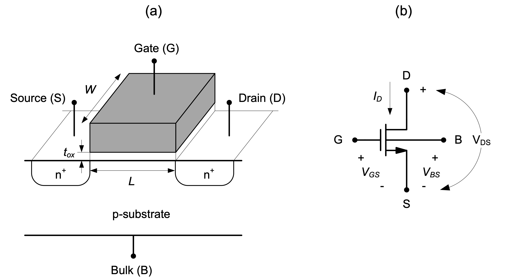
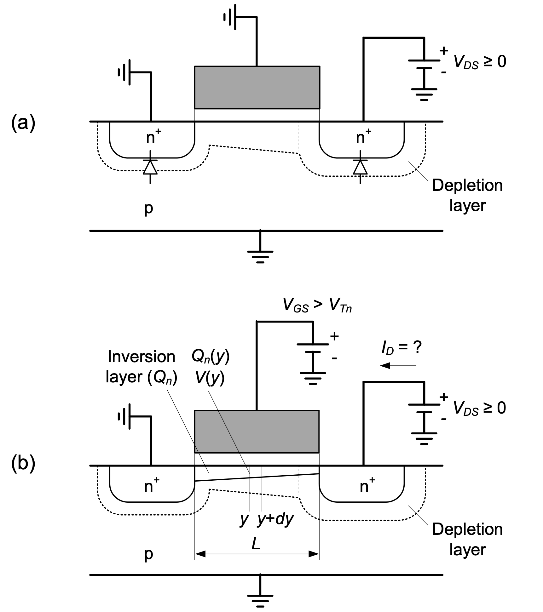

<!-- TODO: make the side of the webiste look nice -->

# Introduction {#sec-introduction}

With the development of the integrated circuit, the
semiconductor industry is undoubtedly the most
influential industry to appear in our society. Its
impact on almost every person in the world exceeds
that of any other industry since the beginning of the
Industrial Revolution. The reasons for its success are
as follows:

::: {.callout-tip} 

## Chapter Objectives

* Review the MOSFET device structure and basic
operation as described by the square-law model.
* Introduce large- and small-signal analysis tech-
niques using the common-source voltage ampli-
fier as a motivating example.
* Derive a small-signal model for the MOSFET
device, consisting of a transconductance and out-
put resistance element.
* Provide a feel for potential inaccuracies and
range limitations of simple modeling expressions.

:::

## 2-1 First-Order MOSFET Model

The device-level derivations of this section assume
familiarity with basic solid-state physics and electro-
statics. For a ground-up treatment from first princi-
ples, the reader is referred to introductory solid-state
device material (see Reference 1).

## 2-1-1 Derivation of I-V Characteristics

The basic structure of an **enhancement mode n-channel** MOSFET is shown in Figure 2-1(a). It
consists of a lightly doped p-substrate (**bulk**), two
heavily doped n-type regions (**source** and **drain**) and
a conductive gate electrode that is isolated from the
substrate using a thin silicon dioxide layer of thick-
ness tox. Other important geometry parameters of
this device include the **channel length** *L* (distance
between the source and drain) and the **channel width** *W*.

{width=100%}

**Figure 2-1:** (a) Cross-section of an n-channel MOSFET. (b) Schematic symbol.

<!-- QUESTION Where should be the picture 2-1 placed? is it good as I did it? -->

&nbsp;&nbsp;&nbsp;As we shall see, the name “n-channel”
stems from the fact that this device conducts current
by forming an n-type layer underneath the gate. A
p-channel device can be constructed similarly using
an n-type bulk and p-type source/drain regions. The
differentiating details between n- and **p-channel**
devices are summarized in Section 2-1-2. For the
time being, we will use the n-channel device to dis-
cuss the basic principles.
<!-- QUESTION do we want to have an embedded link to Section 2-2 ? --> 
In order to study the electrical behavior of a
MOSFET, it is useful to define a schematic symbol
and conventions for electrical variables as shown in
Figure 2-1(b).
<!-- QUESTION EMBEDDED link PICTURE FOR FIGURE 2-1B? -->
The variables $V_{GS}$, $V_{DS}$, and $V_{BS}$ describe the voltages between the respective terminals using the commonly used ordered subscript convention $V_{XY}$ = $V_{X}$ – $V_{Y}$. The current flowing into the
drain node is labeled $I_{D}$.

&nbsp;&nbsp;&nbsp;<!-- QUESTION are three spaces enough as indentation? --> 
It is important to note that the MOSFET device
considered here is perfectly symmetric; i.e., the drain
and source terminal labels can be interchanged. It is
a common convention to assign the source to the
lower potential of these two terminals, since this terminal is the source of electrons that enable the flow
of current. We will see later that this convention,
together with the arrow that marks the source (and
the direction of current flow), provides useful intuition when reading a larger circuit schematic.

&nbsp;&nbsp;&nbsp;We now begin our analysis of the MOSFET
device by considering the condition shown in
Figure 2-2(a), where the bulk and source are connected to a reference potential (GND), $V_{GS}$ = 0V and $V_{DS}$ = 0 V. Under this condition, the drain and
source terminals are isolated by two reverse-biased
pn-junctions and their **depletion regions**, which prevent any significant flow of current. Applying a positive voltage at the drain ($V_{DS}$ > 0V) increases the
reverse-bias at the drain-bulk junction and will only
increase the width of the depletion region at the
drain, while $I_{D}$ = 0 is still maintained (to first-order).

&nbsp;&nbsp;&nbsp;Consider now $V_{GS}$ = 0 as shown in Figure 2-2(b).<!-- QUESTION embedded link to picture?-->
This positive voltage at the gate attracts electrons from the source. With increasing $V_{GS}$, a larger amount of electrons is supplied by the source, and
ultimately, a so-called **inversion layer** forms underneath the gate. The voltage $V_{GS}$ at which a significant
number of mobile electrons underneath the gate become available is called the **threshold voltage** of
the transistor, or $V_{t}$. In order to differentiate the
threshold voltages and other device parameters of n-and p-channel devices, we will utilize the subscripts
n and p throughout this module. E.g., we denote the
threshold voltage for n-channels and p-channels as
$V_{Tn}$ and $V_{Tp}$., respectively.

{width=100%}

**Figure 2-2:** (a) n-channel MOSFET with $V_{GS}$ = 0 and
(b) $V_{GS}$ > $V_{Tn}$.

<!-- FIXME FIGUE OUT HOW TO MAKE THE PICTURE IN THE CENTER IF IT IS NOT 100% SIZE-->

&nbsp;&nbsp;&nbsp;With the inversion layer under the gate, the drain
and source regions are now “connected” through a
conductive path and any voltage between these terminals ($V_{GS}$ > 0) will result in a flow of drain current.
How can we calculate this current? In order to
answer this question, the following approximations
are useful:

&nbsp;&nbsp;&nbsp;**1.** The current primarily depends on the number of
mobile electrons in the channel times their
velocity.

&nbsp;&nbsp;&nbsp;**2.** The number of mobile electrons in the channel is set by the vertical electric field from the gate
to the conductive channel (**gradual channel
approximation**).

&nbsp;&nbsp;&nbsp;**3.**  The threshold voltage is constant along the channel; this assumption neglects the so-called
body effect.

&nbsp;&nbsp;&nbsp;**4.** The velocity of the electrons traveling from the source to the drain is proportional to the lateral electric field in the channel.

&nbsp;&nbsp;&nbsp;Figure 2-2(b)<!--QUESTION embedded picture?-->
 establishes relevant variables for
further analysis. The auxiliary variable *y* ranges from
0 to *L* and is used to express electrical quantities as a
function of the distance from the source. The inversion layer charge density (per unit area) and voltage at position *y* in the channel are denoted as $Q_{n}(y)$ and $V_{y}$, respectively. With these conventions in place,
we can translate the above-listed assumptions into
the following equations:

